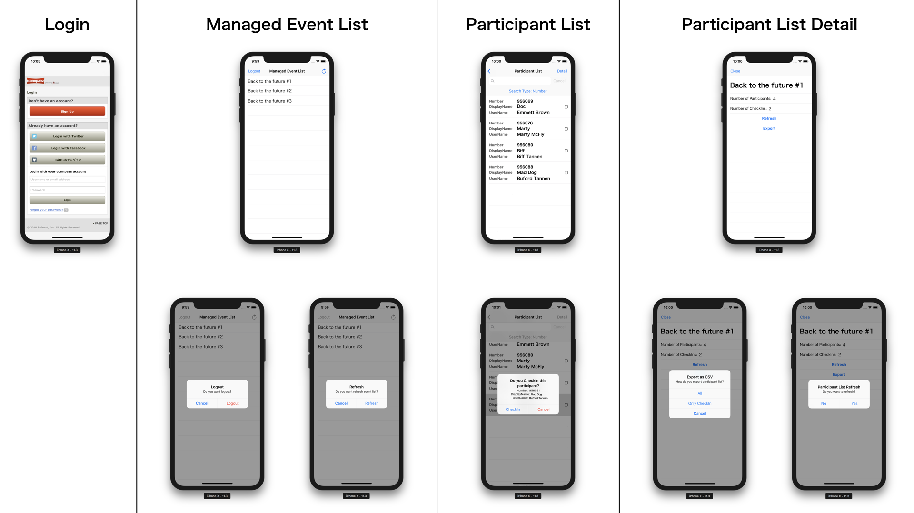

# ConnpassAttendanceChecker

This is a webscraping based iOS application.

## Feature

- [Connpass](https://connpass.com) Login
- List Events and Participants
- Search a participant with Number, UserName or DisplayName
- Check attendance for an event (CheckIn / CheckOut)
- Export CheckIn List as CSV
- Localize English and Japanese

## Requirements

- Swift 4.1.2
- Xcode 9.4.1
- iOS 10.0
- Carthage 0.26.0
- [Kanna](https://github.com/tid-kijyun/Kanna) 4.0.1
- [RxSwift](https://github.com/ReactiveX/RxSwift) 4.2.0
- [Kingfisher](https://github.com/onevcat/Kingfisher) 4.8.1

## Author

marty-suzuki, s1180183@gmail.com

## License

ConnpassAttendanceChecker is available under the MIT license. See the LICENSE file for more info.
